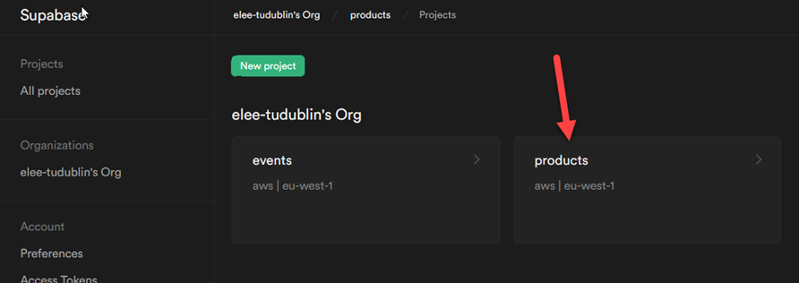
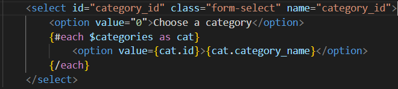

# Web API SvelteKit Client: Add a new Product

Enda Lee 2022

### Quick Start

1. Download or `fork` the start site from this repository.
2. Open in VS Code.
3. copy `sample.env` to `.env` and configure for your database.
4. In a terminal run `npm install`
5. Start the application using `npm run dev`


## Introduction

In this tutorial you will add new products the Database via an **`HTTP POST`** request to the API. The body of the POST request will include the values for a new product which need to be validated and inserted.

The web API (Supabase) will use SQL commands to accomplish the above but that will be hidden from users of the API who will only see the HTTP interface.

When http://localhost:5173 loads first, the empty default page looks like the following. 


This page shows the current list of products (and categories). This lab will enable new products to be added via a form.


## 1. Pre-requisites

Make sure that your Supabase database instance is setup and running





## 2. Add a new Product via the form

#### 2.1. Show the form when the Add Product button is clicked

The button will be displayed under the products list:


Open the home page, `src/routes/routes/+page.svelte`, add a button link:


```html
<a id="AddProductButton" class="btn btn-primary" href="/addproduct" role="button">New Product</a>
```


#### 2.2  The form page and route

You can see that the button links to `/addproduct`. Add this route to the `routes` folder:

1. Add a new subfolder named after the route `addproduct`.
2. Add the svelte client page `+page.svelte`
3. Add a svelte server script `+page.server.js`   


##### The form (`+page.svelte`)

This is a **Bootstrap 5** styled form, which will look like this when displayed:


```html
<!-- Main Content - Products etc. -->
<div class="container">
		<div class="row">
			<!-- Page Header -->
			<h2 class="mt-5">Add Product</h2>
		</div>

		<div class="row">
			<!-- Product Form -->
			<form method="POST" action="?/addproduct">
				<div class="form-group">
					<label for="category_id">Category:</label>
					<select id="category_id" class="form-select" name="category_id">
						<option value="0">Choose a category</option>
						{#each $categories as cat}
							<option value={cat.id}>{cat.category_name}</option>
						{/each}
					</select>
				</div>
				<div class="form-group">
					<label for="product_name">Name:</label>
					<input id="product_name" type="text" class="form-control" name="product_name" />
				</div>
				<div class="form-group">
					<label for="product_description">Description:</label>
					<input
						id="product_description"
						type="text"
						class="form-control"
						name="product_description"
					/>
				</div>
				<div class="form-group">
					<label for="product_stock">Stock:</label>
					<input id="product_stock" type="number" class="form-control" name="product_stock" />
				</div>
				<div class="form-group">
					<label for="product_price">Price:</label>
					<input
						id="product_price"
						type="number"
						min="0.00"
						max="10000.00"
						step="0.01"
						class="form-control"
						name="product_price"
					/>
				</div>
				<!-- productId is a hidden field value is not required but set = 0-->
				<input id="id" type="hidden" value="0" />
				<!-- Buttons - note onclick and data-dismiss attribtes-->
				<button class="btn btn-primary"> Add Product </button>
				<button type="button" class="btn btn-secondary"> Cancel </button>
			</form>
			<!-- End form-->
		</div>
</div>
```


The category select box must be filled so that they can be selected. Add the follow script block at the top to import `categories` from the `product store`

```javascript
<script>
	import { categories } from '../../stores/productsStore.js';
</script>
```


The `{#each}{/each}` block to add an option for each category is already included in the HTML:




## 3. Saving a new product

The Add Product form has two attributes which define what happens after the **Add Product ** button is clicked.

1. **`method="POST"`** will result in a `POST` request to the server with the form data contained in the body of the request.
2. **`action="?/addproduct"`** defines the form `action` - the script/ function which will handle the data sent.


#### 3.1 The `addproduct` `action handler` 

This is defined in the server-side script`addproduct/+page.server.js`

Read the comments for details

```javascript
// Import svelte actions
/** @type {import('./$types').Actions} */

// Import supbase
import {supabase} from "$lib/supabase.js";

// declare some variables for the data
let new_category_id = 0;
let new_product_name = '';
let new_product_description = '';
let new_product_stock = 0;
let new_product_price = 0.00;


// The form action handler(s)
export const actions = {
    // @ts-ignore

    // This is where the form sends its data
    addproduct: async ({request }) => {
      let success = false;

      // get data from the POST request
      const data = await request.formData();

      // read each value - to do: add validation
      new_category_id = data.get('category_id');
      new_product_name = data.get('product_name');
      new_product_description  = data.get('product_description');
      new_product_stock = data.get('product_stock');
      new_product_price = data.get('product_price');

      // Add the new product to Supabase
      const result = await addProductDB();

      // If there is a result - success
      if (result !== null) {
        success = true;
      }
      // return the result
      return { success: success,
               // @ts-ignore
               product: result[0]};
    }
  };


// Function to call Supabase and insert a row
export const addProductDB = async () => {
    const { data, error } = await supabase
    .from('product')
    .insert([
        { category_id: Number(new_category_id), 
          product_name: new_product_name,
          product_description: new_product_description,
          product_stock: Number(new_product_stock),
          product_price: Number(new_product_price)
         },
    ])
    // Select the newly inserted product
    .select();
    
    if(error) {
        return console.error(error);
    }

    // return inserted product
    return data;
}
```


#### 3.2 Show the result of insert in  the addform page

The form page is reloaded after the product is inserted so the result can be displayed. Note the `<script>` block changes from above and also the `{#if} {:else} {/if}` block to control whether the result or form is displayed.


```html
<script>

	// Import the product store (categories)
	import { categories } from '../../stores/productsStore.js';

	// Handle data returned by the form action after insert
	/** @type {import('./$types').PageData} */
	export let data;

	/** @type {import('./$types').ActionData} */
	export let form;

	// A console log for debugging purposes
	console.log('data client: ', data);
</script>

<!-- Main Content - Products etc. -->
<div class="container">
	<!-- If the insert was sucessfull display the new product details-->
	{#if form?.success}

		<div class="row">
			<!-- Page Header -->
			<h2 class="mt-5">Product Added Successfully</h2>
		</div>

		<div class="row">
			<div class="form-group">
				<h6>Product ID: {form.product.id}</h6>
			</div>
			<div class="form-group">
				<h6>Category: {form.product.category_id}</h6>
			</div>
			<div class="form-group">
				<h6>Name: {form.product.product_name}</h6>
			</div>
			<div class="form-group">
				<h6>Description: {form.product.product_description}</h6>
			</div>
			<div class="form-group">
				<h6>Stock: {form.product.product_stock}</h6>
			</div>
			<div class="form-group">
				<h6>Price: {form.product.product_price}</h6>
			</div>
		</div>
	<!-- else show the form again (very simple error handling - should also show validation errors)-->
	{:else}
		<div class="row">
			<!-- Page Header -->
			<h2 class="mt-5">Add Product</h2>
		</div>

		<div class="row">
			<!-- Product Form -->
			<form method="POST" action="?/addproduct">
				<div class="form-group">
					<label for="category_id">Category:</label>
					<select id="category_id" class="form-select" name="category_id">
						<option value="0">Choose a category</option>
						{#each $categories as cat}
							<option value={cat.id}>{cat.category_name}</option>
						{/each}
					</select>
				</div>
				<div class="form-group">
					<label for="product_name">Name:</label>
					<input id="product_name" type="text" class="form-control" name="product_name" />
				</div>
				<div class="form-group">
					<label for="product_description">Description:</label>
					<input
						id="product_description"
						type="text"
						class="form-control"
						name="product_description"
					/>
				</div>
				<div class="form-group">
					<label for="product_stock">Stock:</label>
					<input id="product_stock" type="number" class="form-control" name="product_stock" />
				</div>
				<div class="form-group">
					<label for="product_price">Price:</label>
					<input
						id="product_price"
						type="number"
						min="0.00"
						max="10000.00"
						step="0.01"
						class="form-control"
						name="product_price"
					/>
				</div>
				<!-- productId is a hidden field value is not required but set = 0-->
				<input id="id" type="hidden" value="0" />
				<!-- Buttons - note onclick and data-dismiss attribtes-->
				<button class="btn btn-primary"> Add Product </button>
				<button type="button" class="btn btn-secondary"> Cancel </button>
			</form>
			<!-- End form-->
		</div>
	{/if} <!-- End the if block-->
</div>

```


------

Enda Lee 2022
